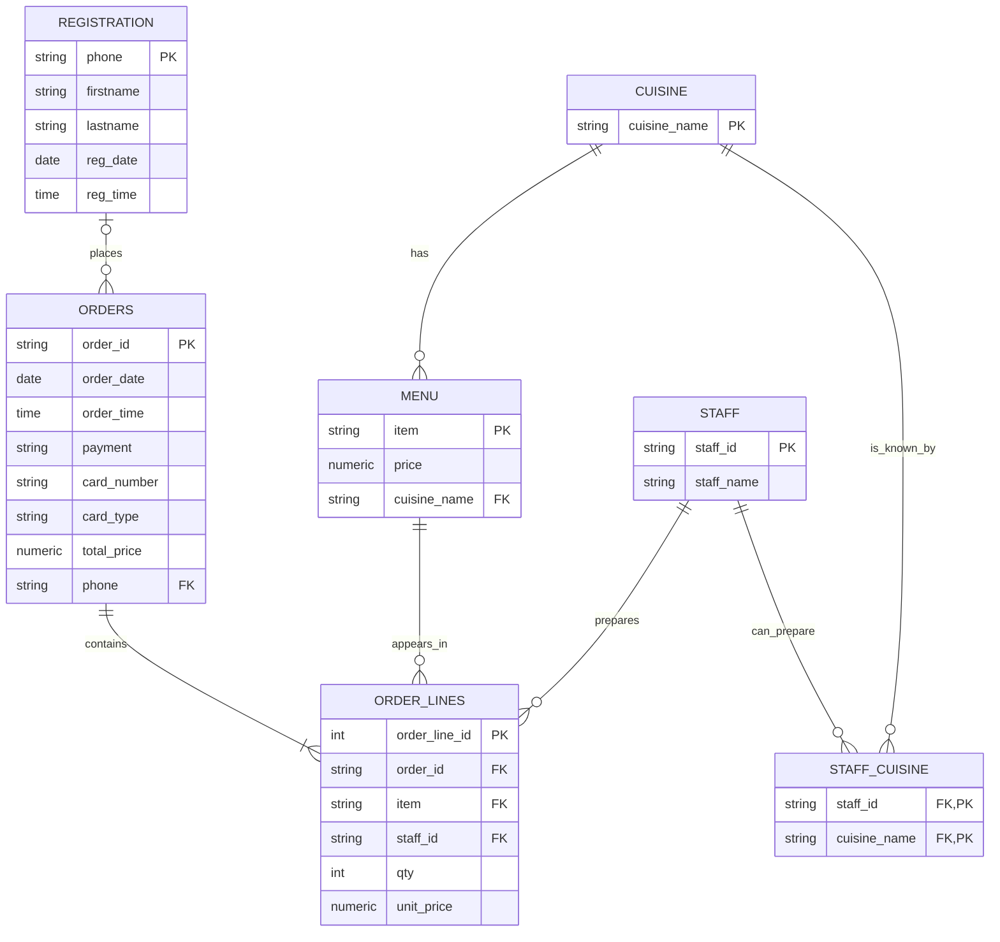

```mermaid
erDiagram
  CUISINE {
    string cuisine_name PK
  }
  MENU {
    string item PK
    numeric price
    string cuisine_name FK
  }
  REGISTRATION {
    string phone PK
    string firstname
    string lastname
    date   reg_date
    time   reg_time
  }
  STAFF {
    string staff_id PK
    string staff_name
  }
  STAFF_CUISINE {
    string staff_id FK,PK
    string cuisine_name FK,PK
  }
  ORDERS {
    string order_id PK
    date   order_date
    time   order_time
    string payment
    string card_number
    string card_type
    numeric total_price
    string phone FK 
  }
  ORDER_LINES {
    int    order_line_id PK
    string order_id FK
    string item FK
    string staff_id FK
    int    qty
    numeric unit_price
  }

  %% Relationships (with cardinality)
  %% A cuisine can have one or more menu items (1,n). A menu item must belong to one cuisine (1).
  CUISINE       ||--o{ MENU          : has
  
  %% A staff member can prepare zero or more cuisines (0,n). A cuisine is known by one staff member (1).
  STAFF         ||--o{ STAFF_CUISINE : can_prepare
  
  %% A cuisine can be known by zero or more staff members (0,n). A staff member knows one cuisine (1).
  CUISINE       ||--o{ STAFF_CUISINE : is_known_by
  
  %% A registration can place zero or more orders (0,n). An order may be placed by a registered user (0,1).
  REGISTRATION  o|--o{ ORDERS        : places
  
  %% An order must have one or more order lines (1,n). An order line must belong to one order (1).
  ORDERS        ||--|{ ORDER_LINES   : contains
  
  %% A menu item appears in zero or more order lines (0,n). An order line must be for one menu item (1).
  MENU          ||--o{ ORDER_LINES   : appears_in
  
  %% A staff member prepares zero or more order lines (0,n). An order line is prepared by one staff member (1).
  STAFF         ||--o{ ORDER_LINES   : prepares

```